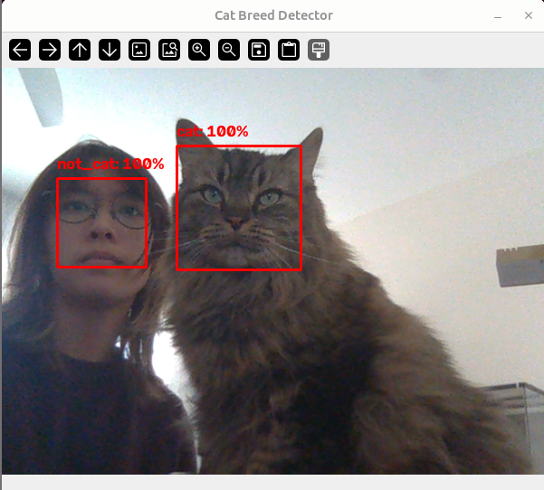

# Cat Breed Detector
I made a smile detector using deep learning. I applied it to accurately classifying things as "cats" and "not cats".

| **Engineer** | **School** | **Area of Interest** | **Grade** |
|:--:|:--:|:--:|:--:|
| Zoe C | Academic Magnet HS | Nuclear Engineering and Deep Learning | Incoming Junior

  
# Final Milestone

<iframe width="560" height="315" src="https://www.youtube.com/embed/KRc8iOeX4nE?si=7IZvbn6GO3qBfFDw" title="YouTube video player" frameborder="0" allow="accelerometer; autoplay; clipboard-write; encrypted-media; gyroscope; picture-in-picture; web-share" allowfullscreen></iframe>

I added a second CNN to classify cat breeds once a cat is detected on a webcam or in a photo.

It took a large amount of trial and error with training. I edited the dataset multiple times to get rid of mislabeled images and I tested different codes to see which would yield the best accuracy.

I learned a lot about CNNs and how to use them, and I improved my problem-solving skills a lot. I hope that I can continue to use these skills once I move onto my next machine learning project!

# Second Milestone

<iframe width="560" height="315" src="https://www.youtube.com/embed/VMCjQQUHiyg?si=wXJ44Xh4ZkwI5vAN" title="YouTube video player" frameborder="0" allow="accelerometer; autoplay; clipboard-write; encrypted-media; gyroscope; picture-in-picture; web-share" allowfullscreen></iframe>

I adapted my smile detector into a cat detector, which can identify objects/faces as a "cat" or "not cat" with a 95%+ accuracy.

To accomplish this, I changed the depth parameter so that it analyzed the images in RGB instead of grayscale, and used MobileNetV2 as the base model rather than LeNet. 

Using a preexisting model to train your network is known as transfer learning, where you freeze the base of the network and cut off the "head" (the top layers it was trained on) so that you can implement your own dataset. Using MobileNetV2 not only shortened the time it took to train but also assisted in higher accuracy. My favorite part about doing this project so far was being able to get hands-on experience with machine learning rather than using YouTube videos.

Originally, I was going to train my CNN to identify cat breeds, but the large amount of breeds in my dataset along with the uneven amounts of data for each one made it extremely inaccurate. I ended up having to scale down the ambition of my project in order to get good results.

For my final milestone, I hope to be able to reimplement the cat breed classifier as well.

# First Milestone

<iframe width="560" height="315" src="https://www.youtube.com/embed/iFsVW0_bvoQ?si=i9X5aGsMF0z5Ny_w" title="YouTube video player" frameborder="0" allow="accelerometer; autoplay; clipboard-write; encrypted-media; gyroscope; picture-in-picture; web-share" allowfullscreen></iframe>

I trained a convolutional neural network to detect smiling and not smiling faces. It utilizes two main parts: A Haar Classifier and a CNN.

**What is a convolutional neural network (CNN)?** A nueral network allows the computer to function analogously to the brain (Dubnov and Greer, 2023). A CNN is a deep learning model designed for processing data such as images. It uses filters called kernels that scan for patterns and create feature maps then defines those shapes and shrinks the data so that it doesn’t memorize unimportant details. 

**What is a Haar Classifier?** A Haar Classifier is a tool used in machine learning, specifically with visuals. It uses hundreds of positive images and negative images to classify shapes. It checks for simple shapes and patterns for classification.

It was quite surprising how much debugging I had to do. I ran into many issues such as getting the correct files and making sure the code was operating correctly. For my next milestone, I will apply what I have learned to create a detector that can identify different breeds cats.

# Code

**Training: cat/not cat**

  <pre style="
    margin: 0;
    white-space: pre-wrap;
    overflow-wrap: anywhere;
    word-break: break-word;
    font-family: Consolas, monospace;
    font-size: 14px;
    line-height: 1.5;
  "><code>

from tensorflow.keras.preprocessing.image import ImageDataGenerator
from tensorflow.keras.optimizers import Adam
from tensorflow.keras.callbacks import EarlyStopping, ModelCheckpoint, ReduceLROnPlateau
from tensorflow.keras.models import load_model
from pyimagesearch.nn.conv.catbreednet import CatBreedNet
from sklearn.metrics import classification_report, confusion_matrix
import matplotlib.pyplot as plt
import numpy as np
import argparse
import os

ap = argparse.ArgumentParser()
ap.add_argument("-d", "--dataset", required=True,
	help="path to dataset root, expected to contain train/ and test/ "
	     "subfolders, each containing exactly two folders: 'cat' and 'not_cat'")
ap.add_argument("-m", "--model", required=True,
	help="path to output model (.h5)")
ap.add_argument("-a", "--arch", choices=["transfer", "scratch"],
	default="transfer",
	help="'transfer' = MobileNetV2 fine-tuning (recommended default for "
	     "this dataset), 'scratch' = from-scratch CNN like the tutorial's LeNet")
ap.add_argument("-e", "--epochs", type=int, default=25,
	help="max epochs for phase-1 (head-only) training -- early stopping "
	     "will likely halt before this if it's not helping anymore")
ap.add_argument("--finetune-epochs", type=int, default=15,
	help="max epochs for phase-2 fine-tuning (transfer arch only; ignored for scratch)")
ap.add_argument("--patience", type=int, default=7,
	help="epochs with no val_loss improvement before early stopping kicks in")
ap.add_argument("-s", "--size", type=int, default=128,
	help="width/height to resize images to (square). Must be >=96 for --arch transfer")
ap.add_argument("-p", "--plot", default="output/training_plot.png",
	help="path to output training history plot")
ap.add_argument("--report", default="output/classification_report.txt",
	help="path to output per-class precision/recall/F1 report")
ap.add_argument("--confusion-matrix", default="output/confusion_matrix.png",
	help="path to output confusion matrix plot")
args = vars(ap.parse_args())

trainDir = os.path.join(args["dataset"], "train")
testDir = os.path.join(args["dataset"], "test")
for d in (trainDir, testDir):
	if not os.path.isdir(d):
		raise SystemExit(
			"[ERROR] expected '{}' to exist. Point --dataset at a folder "
			"containing train/ and test/ subfolders, each with exactly "
			"two folders inside: 'cat' and 'not_cat'.".format(d))

os.makedirs(os.path.dirname(args["model"]) or ".", exist_ok=True)

trainAug = ImageDataGenerator(
	rescale=1.0 / 255.0,
	rotation_range=15,
	zoom_range=0.15,
	width_shift_range=0.1,
	height_shift_range=0.1,
	shear_range=0.1,
	horizontal_flip=True,
	fill_mode="nearest")
testAug = ImageDataGenerator(rescale=1.0 / 255.0)

batchSize = 32
trainGen = trainAug.flow_from_directory(
	trainDir, target_size=(args["size"], args["size"]),
	color_mode="rgb", batch_size=batchSize, class_mode="categorical",
	shuffle=True, seed=42)
testGen = testAug.flow_from_directory(
	testDir, target_size=(args["size"], args["size"]),
	color_mode="rgb", batch_size=batchSize, class_mode="categorical",
	shuffle=False)

classNames = sorted(trainGen.class_indices, key=trainGen.class_indices.get)
numClasses = len(classNames)
print("[INFO] found {} classes: {}".format(numClasses, classNames))
print("[INFO] {} training images, {} test images".format(
	trainGen.samples, testGen.samples))

if numClasses != 2 or set(classNames) != {"cat", "not_cat"}:
	raise SystemExit(
		"[ERROR] expected exactly two folders named 'cat' and 'not_cat' "
		"inside train/ (and test/), found: {}".format(classNames))

counts = np.bincount(trainGen.classes, minlength=numClasses)
classWeight = {i: counts.max() / c for i, c in enumerate(counts)}
print("[INFO] class weights range: {:.2f} - {:.2f}".format(
	min(classWeight.values()), max(classWeight.values())))

def make_callbacks(checkpoint_path):
	"""Builds the three callbacks used for every training phase:
	  - ModelCheckpoint: saves ONLY the best-val_loss epoch's weights
	    to disk, so a late epoch that overfits doesn't overwrite a
	    better earlier one.
	  - EarlyStopping: stops training once val_loss hasn't improved
	    for `patience` epochs, and restores the best-epoch weights
	    into the model in memory (so we don't have to manually reload
	    the checkpoint afterward).
	  - ReduceLROnPlateau: halves the learning rate if val_loss stalls
	    for a few epochs, so training can keep making progress with
	    smaller steps instead of stalling out completely.
	"""
	return [
		ModelCheckpoint(checkpoint_path, monitor="val_loss",
			save_best_only=True, verbose=1),
		EarlyStopping(monitor="val_loss", patience=args["patience"],
			restore_best_weights=True, verbose=1),
		ReduceLROnPlateau(monitor="val_loss", factor=0.5,
			patience=max(2, args["patience"] // 2),
			min_lr=1e-7, verbose=1),
	]

if args["arch"] == "scratch":
	print("[INFO] building from-scratch CNN...")
	model = CatBreedNet.build_scratch(width=args["size"], height=args["size"],
		depth=3, classes=numClasses)
	model.compile(loss="binary_crossentropy", optimizer="adam",
		metrics=["accuracy"])

	print("[INFO] training network...")
	ckptPath = os.path.splitext(args["model"])[0] + "_checkpoint.h5"
	H = model.fit(
		trainGen,
		validation_data=testGen,
		class_weight=classWeight,
		epochs=args["epochs"],
		callbacks=make_callbacks(ckptPath),
		verbose=1)
	histories = [H]

else:
	print("[INFO] building MobileNetV2 transfer-learning model "
		"(base frozen)...")
	model = CatBreedNet.build_transfer(width=args["size"], height=args["size"],
		depth=3, classes=numClasses, unfreeze_top=0)
	model.compile(loss="binary_crossentropy",
		optimizer=Adam(learning_rate=1e-3), metrics=["accuracy"])

	print("[INFO] phase 1/2: training classification head only...")
	ckptPath1 = os.path.splitext(args["model"])[0] + "_phase1_checkpoint.h5"
	H1 = model.fit(
		trainGen,
		validation_data=testGen,
		class_weight=classWeight,
		epochs=args["epochs"],
		callbacks=make_callbacks(ckptPath1),
		verbose=1)

	print("[INFO] phase 2/2: unfreezing top MobileNetV2 layers, "
		"fine-tuning at a low learning rate...")

	ftModel = CatBreedNet.build_transfer(width=args["size"], height=args["size"],
		depth=3, classes=numClasses, unfreeze_top=30)
	ftModel.set_weights(model.get_weights())
	ftModel.compile(loss="binary_crossentropy",
		optimizer=Adam(learning_rate=1e-5), metrics=["accuracy"])

	ckptPath2 = os.path.splitext(args["model"])[0] + "_phase2_checkpoint.h5"
	H2 = ftModel.fit(
		trainGen,
		validation_data=testGen,
		class_weight=classWeight,
		epochs=args["finetune_epochs"],
		callbacks=make_callbacks(ckptPath2),
		verbose=1)

	model = ftModel
	histories = [H1, H2]

print("[INFO] evaluating on held-out test set...")
loss, acc = model.evaluate(testGen, verbose=0)
print("[INFO] test accuracy: {:.2f}%".format(acc * 100))

print("[INFO] generating per-class report and confusion matrix...")
testGen.reset()
predProbs = model.predict(testGen, verbose=0)
predClasses = np.argmax(predProbs, axis=1)
trueClasses = testGen.classes

report = classification_report(trueClasses, predClasses,
	target_names=classNames, zero_division=0)
print(report)
with open(args["report"], "w") as f:
	f.write(report)
print("[INFO] classification report saved to {}".format(args["report"]))

cm = confusion_matrix(trueClasses, predClasses)
fig, ax = plt.subplots(figsize=(12, 10))
im = ax.imshow(cm, cmap="Blues")
ax.set_xticks(range(numClasses))
ax.set_yticks(range(numClasses))
ax.set_xticklabels(classNames, rotation=90, fontsize=6)
ax.set_yticklabels(classNames, fontsize=6)
ax.set_xlabel("Predicted label")
ax.set_ylabel("True label")
ax.set_title("Confusion Matrix")
fig.colorbar(im, ax=ax, fraction=0.046, pad=0.04)
fig.tight_layout()
fig.savefig(args["confusion_matrix"], dpi=150)
print("[INFO] confusion matrix saved to {}".format(args["confusion_matrix"]))

print("[INFO] serializing network...")
model.save(args["model"])

labelsPath = os.path.splitext(args["model"])[0] + "_labels.txt"
with open(labelsPath, "w") as f:
	for name in classNames:
		f.write(name + "\n")
print("[INFO] class labels saved to {}".format(labelsPath))

loss_hist, val_loss_hist, acc_hist, val_acc_hist = [], [], [], []
for h in histories:
	loss_hist += h.history["loss"]
	val_loss_hist += h.history["val_loss"]
	acc_hist += h.history["accuracy"]
	val_acc_hist += h.history["val_accuracy"]

os.makedirs(os.path.dirname(args["plot"]) or ".", exist_ok=True)
plt.style.use("ggplot")
plt.figure()
epochs_range = np.arange(0, len(loss_hist))
plt.plot(epochs_range, loss_hist, label="train_loss")
plt.plot(epochs_range, val_loss_hist, label="val_loss")
plt.plot(epochs_range, acc_hist, label="train_acc")
plt.plot(epochs_range, val_acc_hist, label="val_acc")
if len(histories) > 1:
	plt.axvline(x=len(histories[0].history["loss"]), color="gray",
		linestyle="--", label="fine-tuning starts")
plt.title("Training Loss and Accuracy")
plt.xlabel("Epoch #")
plt.ylabel("Loss/Accuracy")
plt.legend()
plt.savefig(args["plot"])
print("[INFO] training plot saved to {}".format(args["plot"]))

  </code></pre>

**Training: cat breeds**

  <pre style="
    margin: 0;
    white-space: pre-wrap;
    overflow-wrap: anywhere;
    word-break: break-word;
    font-family: Consolas, monospace;
    font-size: 14px;
    line-height: 1.5;
  "><code>

import argparse
import json
import os

import matplotlib.pyplot as plt
import numpy as np
import tensorflow as tf

from tensorflow.keras import Model
from tensorflow.keras.applications import MobileNetV2
from tensorflow.keras.applications.mobilenet_v2 import preprocess_input
from tensorflow.keras.callbacks import (
    EarlyStopping,
    ModelCheckpoint,
    ReduceLROnPlateau,
)
from tensorflow.keras.layers import (
    Dense,
    Dropout,
    GlobalAveragePooling2D,
    Input,
)
from tensorflow.keras.optimizers import Adam

IMAGE_SIZE = 224
BATCH_SIZE = 32
AUTOTUNE = tf.data.AUTOTUNE
SEED = 42
VALIDATION_SPLIT = 0.15  # carved out of train/ only; test/ is used whole

def parse_arguments():
    parser = argparse.ArgumentParser()

    parser.add_argument(
        "-d",
        "--dataset",
        required=True,
        help="path to dataset root, expected to contain 'train' and "
             "'test' subfolders, each with one folder per breed",
    )

    parser.add_argument(
        "-m",
        "--model",
        required=True,
        help="output model path, for example output/breed_cnn.keras",
    )

    parser.add_argument(
        "-l",
        "--labels",
        default="output/cat_breed_v2_labels.json",
        help="output JSON file containing breed names",
    )

    parser.add_argument(
        "-e",
        "--epochs",
        type=int,
        default=25,
        help="epochs for the frozen MobileNetV2 stage",
    )

    parser.add_argument(
        "--fine-tune-epochs",
        type=int,
        default=15,
        help="additional fine-tuning epochs",
    )

    return vars(parser.parse_args())

def load_datasets(dataset_path):
    """
    Load images from this expected structure:

        dataset_path/
            train/
                breed_1/
                    image1.jpg
                breed_2/
                    image1.jpg
            test/
                breed_1/
                    image1.jpg
                breed_2/
                    image1.jpg
    """

    train_dir = os.path.join(dataset_path, "train")
    test_dir = os.path.join(dataset_path, "test")

    for directory in (train_dir, test_dir):
        if not os.path.isdir(directory):
            raise RuntimeError(
                f"Expected '{directory}' to exist, with one folder "
                "per breed inside."
            )

    print("[INFO] loading dataset from train/ and test/ folders...")

    # carve a validation split out of train/ only, so early stopping
    # and LR reduction have something to monitor during training
    train_dataset = tf.keras.utils.image_dataset_from_directory(
        train_dir,
        labels="inferred",
        label_mode="int",
        validation_split=VALIDATION_SPLIT,
        subset="training",
        seed=SEED,
        image_size=(IMAGE_SIZE, IMAGE_SIZE),
        batch_size=BATCH_SIZE,
        shuffle=True,
    )

    validation_dataset = tf.keras.utils.image_dataset_from_directory(
        train_dir,
        labels="inferred",
        label_mode="int",
        validation_split=VALIDATION_SPLIT,
        subset="validation",
        seed=SEED,
        image_size=(IMAGE_SIZE, IMAGE_SIZE),
        batch_size=BATCH_SIZE,
        shuffle=True,
    )

    breed_names = train_dataset.class_names

    # test/ is used in full, untouched -- no split needed since it's
    # already a separate folder
    test_dataset = tf.keras.utils.image_dataset_from_directory(
        test_dir,
        labels="inferred",
        label_mode="int",
        seed=SEED,
        image_size=(IMAGE_SIZE, IMAGE_SIZE),
        batch_size=BATCH_SIZE,
        shuffle=False,
    )

    if test_dataset.class_names != breed_names:
        print(
            "[WARNING] breed folders in train/ and test/ don't match "
            "exactly.\n"
            f"  train/: {breed_names}\n"
            f"  test/:  {test_dataset.class_names}"
        )

    print(f"[INFO] found {len(breed_names)} breeds")

    for index, name in enumerate(breed_names):
        print(f"  {index:2d}: {name}")

    return (
        train_dataset,
        validation_dataset,
        test_dataset,
        breed_names,
    )

def augment_and_preprocess(images, labels):
    """
    Apply training augmentation and MobileNetV2 preprocessing.
    """

    images = tf.cast(images, tf.float32)

    images = tf.image.random_flip_left_right(images)

    images = tf.image.random_brightness(
        images,
        max_delta=20.0,
    )

    images = tf.image.random_contrast(
        images,
        lower=0.8,
        upper=1.2,
    )

    images = tf.clip_by_value(
        images,
        0.0,
        255.0,
    )

    images = preprocess_input(images)

    return images, labels

def preprocess_only(images, labels):
    """
    Apply only MobileNetV2 preprocessing to validation/test images.
    """

    images = tf.cast(images, tf.float32)
    images = preprocess_input(images)

    return images, labels

def prepare_datasets(
    train_dataset,
    validation_dataset,
    test_dataset,
):
    train_dataset = train_dataset.map(
        augment_and_preprocess,
        num_parallel_calls=AUTOTUNE,
    )

    validation_dataset = validation_dataset.map(
        preprocess_only,
        num_parallel_calls=AUTOTUNE,
    )

    test_dataset = test_dataset.map(
        preprocess_only,
        num_parallel_calls=AUTOTUNE,
    )

    train_dataset = train_dataset.prefetch(AUTOTUNE)
    validation_dataset = validation_dataset.prefetch(AUTOTUNE)
    test_dataset = test_dataset.prefetch(AUTOTUNE)

    return (
        train_dataset,
        validation_dataset,
        test_dataset,
    )

def build_model(number_of_breeds):
    inputs = Input(
        shape=(IMAGE_SIZE, IMAGE_SIZE, 3),
        name="image",
    )

    base_model = MobileNetV2(
        input_shape=(IMAGE_SIZE, IMAGE_SIZE, 3),
        include_top=False,
        weights="imagenet",
    )

    # Initially train only the new classification head.
    base_model.trainable = False

    features = base_model(
        inputs,
        training=False,
    )

    x = GlobalAveragePooling2D()(features)
    x = Dropout(0.35)(x)

    outputs = Dense(
        number_of_breeds,
        activation="softmax",
        name="breed_probabilities",
    )(x)

    model = Model(
        inputs=inputs,
        outputs=outputs,
        name="cat_breed_classifier",
    )

    return model, base_model

def plot_history(first_history, fine_history=None):
    training_accuracy = list(
        first_history.history["accuracy"]
    )

    validation_accuracy = list(
        first_history.history["val_accuracy"]
    )

    training_loss = list(
        first_history.history["loss"]
    )

    validation_loss = list(
        first_history.history["val_loss"]
    )

    if fine_history is not None:
        training_accuracy += fine_history.history["accuracy"]
        validation_accuracy += fine_history.history["val_accuracy"]
        training_loss += fine_history.history["loss"]
        validation_loss += fine_history.history["val_loss"]

    epochs = np.arange(
        1,
        len(training_loss) + 1,
    )

    plt.figure()
    plt.plot(
        epochs,
        training_loss,
        label="train_loss",
    )
    plt.plot(
        epochs,
        validation_loss,
        label="validation_loss",
    )
    plt.xlabel("Epoch")
    plt.ylabel("Loss")
    plt.title("Cat Breed Training Loss")
    plt.legend()
    plt.tight_layout()
    plt.show()

    plt.figure()
    plt.plot(
        epochs,
        training_accuracy,
        label="train_accuracy",
    )
    plt.plot(
        epochs,
        validation_accuracy,
        label="validation_accuracy",
    )
    plt.xlabel("Epoch")
    plt.ylabel("Accuracy")
    plt.title("Cat Breed Training Accuracy")
    plt.legend()
    plt.tight_layout()
    plt.show()

def main():
    args = parse_arguments()

    if not os.path.isdir(args["dataset"]):
        raise RuntimeError(
            f"Dataset directory does not exist: {args['dataset']}"
        )

    model_directory = os.path.dirname(args["model"])
    labels_directory = os.path.dirname(args["labels"])

    if model_directory:
        os.makedirs(
            model_directory,
            exist_ok=True,
        )

    if labels_directory:
        os.makedirs(
            labels_directory,
            exist_ok=True,
        )

    (
        train_dataset,
        validation_dataset,
        test_dataset,
        breed_names,
    ) = load_datasets(args["dataset"])

    # Save the breed ordering used by the model.
    with open(
        args["labels"],
        "w",
        encoding="utf-8",
    ) as label_file:
        json.dump(
            breed_names,
            label_file,
            indent=2,
        )

    print(
        f"[INFO] saved breed labels to {args['labels']}"
    )

    (
        train_dataset,
        validation_dataset,
        test_dataset,
    ) = prepare_datasets(
        train_dataset,
        validation_dataset,
        test_dataset,
    )

    print("[INFO] building MobileNetV2 breed classifier...")

    model, base_model = build_model(
        number_of_breeds=len(breed_names),
    )

    model.compile(
        optimizer=Adam(learning_rate=1e-3),
        loss="sparse_categorical_crossentropy",
        metrics=["accuracy"],
    )

    model.summary()

    callbacks = [
        EarlyStopping(
            monitor="val_loss",
            patience=4,
            restore_best_weights=True,
        ),

        ReduceLROnPlateau(
            monitor="val_loss",
            factor=0.25,
            patience=2,
            min_lr=1e-6,
        ),

        ModelCheckpoint(
            filepath=args["model"],
            monitor="val_accuracy",
            save_best_only=True,
        ),
    ]

    print("[INFO] training classification head...")

    first_history = model.fit(
        train_dataset,
        validation_data=validation_dataset,
        epochs=args["epochs"],
        callbacks=callbacks,
        verbose=1,
    )

    fine_history = None

    if args["fine_tune_epochs"] > 0:
        print("[INFO] fine-tuning MobileNetV2...")

        base_model.trainable = True

        # Fine-tune only the final 30 MobileNetV2 layers.
        fine_tune_from = len(base_model.layers) - 30

        for layer in base_model.layers[:fine_tune_from]:
            layer.trainable = False

        model.compile(
            optimizer=Adam(learning_rate=1e-5),
            loss="sparse_categorical_crossentropy",
            metrics=["accuracy"],
        )

        fine_history = model.fit(
            train_dataset,
            validation_data=validation_dataset,
            epochs=args["fine_tune_epochs"],
            callbacks=callbacks,
            verbose=1,
        )

    print("[INFO] loading best saved model...")

    best_model = tf.keras.models.load_model(
        args["model"],
        compile=False,
    )

    best_model.compile(
        optimizer=Adam(),
        loss="sparse_categorical_crossentropy",
        metrics=["accuracy"],
    )

    print("[INFO] evaluating held-out test set...")

    test_loss, test_accuracy = best_model.evaluate(
        test_dataset,
        verbose=1,
    )

    print(f"[RESULT] test loss: {test_loss:.4f}")
    print(f"[RESULT] test accuracy: {test_accuracy:.4f}")

    print(f"[INFO] model saved to: {args['model']}")
    print(f"[INFO] labels saved to: {args['labels']}")

    plot_history(
        first_history,
        fine_history,
    )

if __name__ == "__main__":
    main()

  </code></pre>

**Two step pipeline**

  <pre style="
    margin: 0;
    white-space: pre-wrap;
    overflow-wrap: anywhere;
    word-break: break-word;
    font-family: Consolas, monospace;
    font-size: 14px;
    line-height: 1.5;
  "><code>

import argparse
import os

import cv2
import numpy as np
from tensorflow.keras.models import load_model

ap = argparse.ArgumentParser()
ap.add_argument("--cat-model", required=True,
	help="path to the cat/not_cat detector .h5 file")
ap.add_argument("--cat-labels", required=True,
	help="path to the cat detector's _labels.txt file")
ap.add_argument("--breed-model", required=True,
	help="path to the breed classifier .h5 file")
ap.add_argument("--breed-labels", required=True,
	help="path to the breed classifier's _labels.txt file")
ap.add_argument("--image", help="path to a single image to classify")
ap.add_argument("--video", help="path to a video file (omit for webcam)")
ap.add_argument("--cat-threshold", type=float, default=0.5,
	help="minimum probability to consider a frame/image 'cat' (default 0.5)")
args = vars(ap.parse_args())

def load_labels(path):
	with open(path) as f:
		return [line.strip() for line in f if line.strip()]

def get_input_size(model):
	# model.input_shape is (None, height, width, channels)
	_, height, width, _ = model.input_shape
	return (width, height)

def preprocess(frame, size):
	resized = cv2.resize(frame, size)
	resized = resized.astype("float32") / 255.0
	return np.expand_dims(resized, axis=0)

print("[INFO] loading models...")
catModel = load_model(args["cat_model"])
catLabels = load_labels(args["cat_labels"])
catSize = get_input_size(catModel)

breedModel = load_model(args["breed_model"])
breedLabels = load_labels(args["breed_labels"])
breedSize = get_input_size(breedModel)

catIndex = catLabels.index("cat") if "cat" in catLabels else None
if catIndex is None:
	raise SystemExit(
		"[ERROR] expected 'cat' to be one of the cat detector's labels, "
		"found: {}".format(catLabels))

def classify_frame(frame):
	# stage 1: cat vs not_cat
	catInput = preprocess(frame, catSize)
	catProbs = catModel.predict(catInput, verbose=0)[0]
	catProb = catProbs[catIndex]
	isCat = catProb >= args["cat_threshold"]

	result = {
		"is_cat": bool(isCat),
		"cat_confidence": float(catProb),
		"breed": None,
		"breed_confidence": None,
	}

	# stage 2: only runs if stage 1 said "cat"
	if isCat:
		breedInput = preprocess(frame, breedSize)
		breedProbs = breedModel.predict(breedInput, verbose=0)[0]
		breedIdx = np.argmax(breedProbs)
		result["breed"] = breedLabels[breedIdx]
		result["breed_confidence"] = float(breedProbs[breedIdx])

	return result

def draw_result(frame, result):
	if result["is_cat"]:
		label = "{} ({:.0f}%)".format(
			result["breed"], result["breed_confidence"] * 100)
		color = (0, 200, 0)
	else:
		label = "Not a cat ({:.0f}%)".format(
			(1 - result["cat_confidence"]) * 100)
		color = (0, 0, 200)

	cv2.putText(frame, label, (10, 30),
		cv2.FONT_HERSHEY_SIMPLEX, 0.8, color, 2)
	return frame

if args.get("image"):
	frame = cv2.imread(args["image"])
	if frame is None:
		raise SystemExit("[ERROR] could not read image: {}".format(args["image"]))

	result = classify_frame(frame)
	if result["is_cat"]:
		print("[RESULT] Cat detected ({:.1f}% confidence) -- breed: {} ({:.1f}% confidence)".format(
			result["cat_confidence"] * 100, result["breed"],
			result["breed_confidence"] * 100))
	else:
		print("[RESULT] Not a cat ({:.1f}% confidence)".format(
			(1 - result["cat_confidence"]) * 100))

	frame = draw_result(frame, result)
	cv2.imshow("Result", frame)
	cv2.waitKey(0)
	cv2.destroyAllWindows()

else:
	camera = cv2.VideoCapture(args["video"]) if args.get("video") else cv2.VideoCapture(0)

	while True:
		(grabbed, frame) = camera.read()
		if args.get("video") and not grabbed:
			break

		result = classify_frame(frame)
		frame = draw_result(frame, result)
		cv2.imshow("Two-Stage Cat Detector", frame)

		if cv2.waitKey(1) & 0xFF == ord("q"):
			break

	camera.release()
	cv2.destroyAllWindows()

  </code></pre>

# Bill of Materials

| **Part** | **Note** | **Price** | **Link** |
|:--:|:--:|:--:|:--:|
| Rasperry Pi Kit | Rasperry Pi | $147.69 | <a href="https://www.amazon.com/RasTech-Raspberry-Starter-Heatsink-Screwdriver/dp/B0C8LV6VNZ/ref=sr_1_4?crid=3506HY00MCGVM&dib=eyJ2IjoiMSJ9._zkM62vSQ8p7tNr88715LdMv_qHh72Je-tkF9PXEa3chDE53QT4aZu4AGAb4ihE61QY4ZD55nKF6Fp2Kfs8t7AbafM_JrlJFfHo9OB4eAVGqa0EB-7aoBQHPmhKHZ2MW8ny-Kd44bMVlVxPlTWVk5YHIN5P3uKVqrE5Dcal0rKkHny-O6Xyb5ux2AOU6OwVbkag_bqBX66RQNRrgBuz-0pS43mcx93IZTQA9R8NaJJypYU2HAycp-XicTFmyU60a01Nfm9iuyo6B9yA8ppN3OQQyJ-NQ9xyNPxfTLwkqtng.yAYpU6outhQcZmOZhN9Wb6yTw7A85CNUbXZguGInZNg&dib_tag=se&keywords=raspberry%2Bpi%2Bkit&qid=1718848547&s=electronics&sprefix=rasbperry%2Bpi%2Bkit%2Celectronics%2C83&sr=1-4&th=1"> Link </a> |
| Picam with stand | Camera for the pi | $10.99 | <a href="https://www.amazon.com/Arducam-Raspberry-Camera-Module-1080P/dp/B07RWCGX5K/ref=sr_1_10?crid=1U9IECPRDX3WW&dib=eyJ2IjoiMSJ9.EQptXsj1i39Y9oggTYxdai89FVefBqmO-xGB4sBBTHO4SEXcCZUKpLs1pTfSI2UV6zy9s3AQs7Evflr1mgvYz1YCSz3mqc1fKoWJuY2h_sLEdwqeJmnuUHIk2vmkOBLRlXijApDdRtOGjvFpd22kZibWh01QrWXaEwqpEp-2yRu8AwtKM3-xvdpkUNxIUIbjqrSK_cZ26yCkFh88Ih6aKDnMHVzWvkGv8cZGmAsc7eT7RKndhuCD03QQCco8ZhufAfPk0RJ-nafMKigKik2-9dEEZYTcX1D5vsv4x-weTH8.wWxtDi-AjBJ6-FuY_isVSX857HXALzCvS0vuocOJ6xg&dib_tag=se&keywords=arducam%2Bpicam&qid=1747573778&s=electronics&sprefix=arducam%2Bpicam%2Celectronics%2C89&sr=1-10&th=1"> Link </a> |

# Other Resources/Examples

- Dubnov, Greer. *Deep & Shallow: Machine Learning for Music & Audio*
- [Smile Detector Tutorial](https://pyimagesearch.com/2021/07/14/smile-detection-with-opencv-keras-and-tensorflow/)
- [Cat Dataset](https://www.kaggle.com/datasets/crawford/cat-dataset)
- [Random Images Dataset](https://www.kaggle.com/datasets/ezzzio/random-images)
- [Cat Breed Dataset 1](https://www.kaggle.com/datasets/denispotapov/cat-breeds-dataset-cleared)
- [Cat Breed Dataset 2](https://github.com/atharvataras/cat-breeds-dataset)
